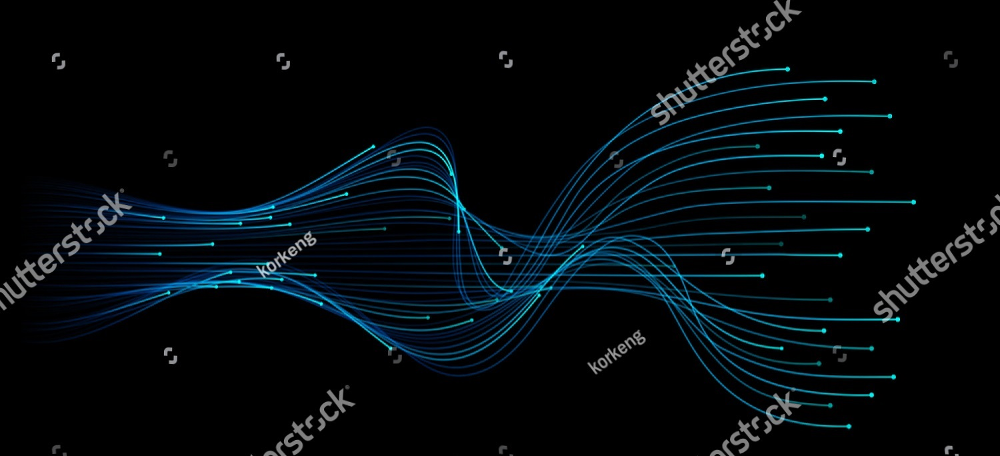

# VIRTUALISATION DE RÉSEAU DE TÉLÉCOMMUNICATIONS DU FUTUR

## La filière Informatique et Systèmes de Communication présente en partenariat avec Swisscom :

- Une nouvelle infrastructure pour la formation et la recherche
- Outil pour former les ingénieurs de demain dans un contexte en pleine mutation
- Environnement de test pour anticiper les évolutions futures des technologies de la communication mobile

 

 

**➜ [GO.HEIA-FR.CH/VIRTUALISATION](GO.HEIA-FR.CH/VIRTUALISATION)**

 

